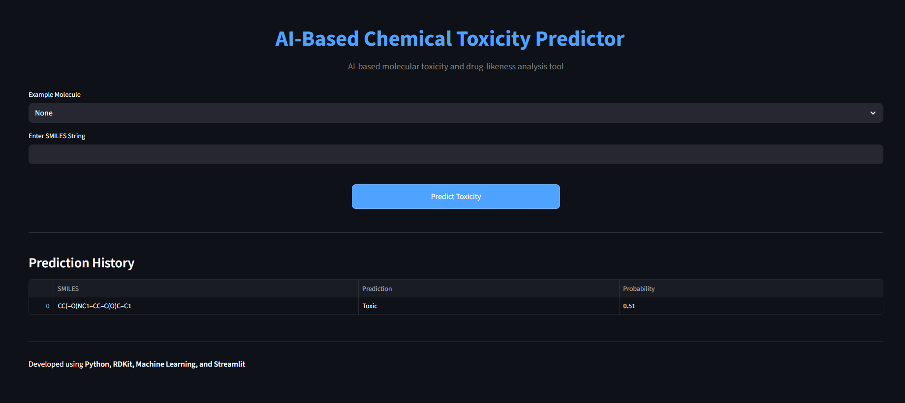

# AI-Based Chemical Toxicity Predictor

This project is an AI-powered web application that predicts the toxicity of chemical compounds using machine learning and cheminformatics techniques.

The application allows users to input chemical structures in SMILES format and analyze their toxicity along with molecular properties and drug-likeness.

---

## Features

- Predicts chemical toxicity using a trained machine learning model
- Molecular structure visualization using RDKit
- Drug-likeness analysis using Lipinski Rule of Five
- Displays molecular properties (Molecular Weight, LogP, H-Bond Donors, H-Bond Acceptors)
- Toxicity probability and risk level visualization
- Example drug molecules for testing
- Prediction history tracking
- Download prediction results

---

## Technologies Used

- Python
- Streamlit
- RDKit
- Scikit-learn
- Pandas
- NumPy

---

## How to Run the Project

1. Install the required libraries:
   pip install -r requirements.txt
2. Run the application:
   streamlit run app.py

---
## Application Preview

## Example Molecules

You can test the following molecules:

- Aspirin
- Caffeine
- Paracetamol
- Ibuprofen

---

## Project Objective

The goal of this project is to demonstrate how artificial intelligence and cheminformatics tools can assist in early-stage drug discovery by predicting chemical toxicity and evaluating drug-likeness properties.

---

## Future Improvements

- Integration with larger toxicity datasets
- Multiple toxicity endpoint prediction
- Molecular similarity search
- Integration with chemical databases

## Author

Banashree Umesh Kudalagi 
B.E. Computer Science Engineering  
AI-Based Chemical Toxicity Predictor Project

